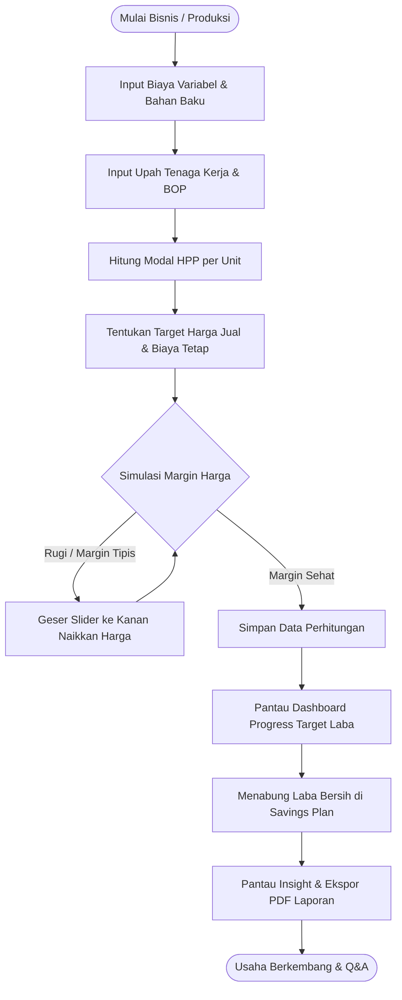
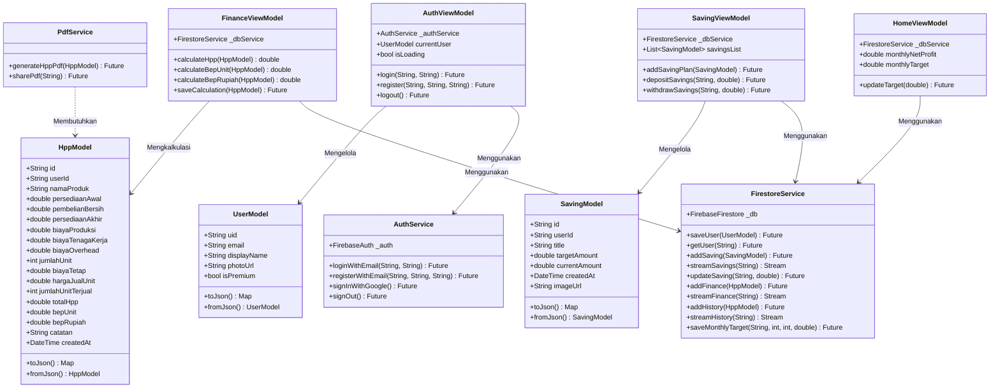

# DOKUMENTASI PRESENTASI & ANALISIS SISTEM: FINANCE TRACKER UMKM

Dokumen ini berisi materi lengkap slide presentasi dan diagram analisis & perancangan sistem informasi untuk aplikasi **Finance Tracker**. 

---

## 1. DAFTAR SLIDE & KONTEN PRESENTASI

### SLIDE 1: Judul Presentasi
* **Judul Utama**: FINANCE TRACKER
* **Sub-Judul**: Solusi Digital Cerdas Perhitungan HPP, BEP, dan Manajemen Keuangan UMKM
* **Presenter**: Kelompok 4 - Proyek Akhir PBL
* **Visual**: Tema Gelap Premium, Aksen Ungu dan Kuning Emas, Desain Minimalis & Profesional.

### SLIDE 2: Latar Belakang & Permasalahan UMKM
* **Fokus Utama**: Mengapa UMKM sering gagal dalam aspek keuangan?
* **Poin Masalah**:
  1. *HPP Tidak Akurat*: Menentukan harga jual hanya berdasarkan perkiraan atau harga pesaing tanpa kalkulasi modal bersih (biaya bahan baku, tenaga kerja, dan overhead).
  2. *Titik Impas (BEP) Buta*: Tidak mengetahui jumlah minimum produk yang harus terjual untuk menutupi seluruh biaya operasional bisnis.
  3. *Manajemen Tabungan Terbengkalai*: Keuangan pribadi dan modal usaha bercampur aduk, tanpa target alokasi tabungan untuk ekspansi (misal: beli peralatan baru).
  4. *Pencatatan Konvensional*: Menggunakan buku fisik yang rentan hilang, rusak, salah hitung, serta tidak memiliki visualisasi visual/tren perkembangan bisnis.

### SLIDE 3: Solusi yang Ditawarkan (Finance Tracker)
* **Definisi**: Aplikasi mobile berbasis Flutter (Android/iOS) terintegrasi Firebase sebagai asisten keuangan personal bagi pelaku UMKM.
* **Pilar Solusi**:
  * **Automated Calculator**: Penghitungan Harga Pokok Penjualan (HPP) dan Break-Even Point (BEP) secara instan dan bebas kesalahan matematika.
  * **Dynamic Pricing Simulator**: Slider interaktif untuk mensimulasikan margin keuntungan dan melihat dampak perubahan harga jual terhadap BEP.
  * **Structured Savings Plan**: Modul tabungan terpisah untuk mengamankan laba bersih demi target jangka panjang.
  * **Visual Dashboard & Insights**: Grafik tren performa finansial bulanan untuk mendukung pengambilan keputusan bisnis yang cerdas.

### SLIDE 4: Alur Bisnis Sistem (Business Flow)
* **Proses Operasional UMKM**:
  1. **Input Biaya**: Menginput rincian biaya variabel produksi dan biaya tetap bulanan.
  2. **Simulasi Harga**: Memperkirakan harga jual yang ideal dengan memantau status margin (Rugi, Rendah, Sedang, Tinggi).
  3. **Simpan Riwayat**: Menyimpan hasil perhitungan ke sistem cloud history.
  4. **Pencatatan Tabungan**: Menyisihkan laba ke rencana tabungan untuk kemandirian finansial bisnis.
  5. **Evaluasi Finansial**: Melihat tren grafik bulanan di Dashboard dan mengekspor laporan dalam format PDF.

### SLIDE 5: Arsitektur Teknologi & Pola Pengembangan
* **Frontend**: Flutter SDK (Dart)
  * Menggunakan pola arsitektur **MVVM (Model-View-ViewModel)** untuk pemisahan kode UI dan logika bisnis.
  * Responsif di berbagai ukuran layar smartphone.
* **Backend & Database**: Firebase Services
  * **Firebase Authentication**: Manajemen akun aman dengan verifikasi email otomatis dan Google Sign-In.
  * **Cloud Firestore**: Database NoSQL real-time yang efisien dan andal.
  * **Firebase Storage**: Penyimpanan foto profil user dan gambar target tabungan.
* **Fitur Premium**:
  * **PdfService**: Ekspor kalkulasi keuangan langsung ke file PDF berkualitas tinggi untuk arsip cetak.

### SLIDE 6: Analisis Sistem - Use Case Diagram
* *Menunjukkan fungsionalitas sistem berdasarkan peran pengguna (Gratis vs Premium).*
* **Aktor**: Pengguna Gratis (Free), Pengguna Premium, Sistem (Firebase Auth & Firestore).
* **Use Case Utama**:
  * Registrasi, Login, Verifikasi Email, & Lupa Sandi.
  * Kelola Target Profit Bulanan & Profil Akun.
  * Hitung HPP & BEP (Input variabel/tetap).
  * Lakukan Simulasi Harga Jual (Interactive Slider).
  * Simpan Perhitungan (Free dibatasi 3 riwayat, Premium tanpa batas).
  * Kelola Rencana Tabungan (Tambah rencana, Simpan tabungan, Tarik tabungan).
  * Pantau Grafik Insight (HPP vs BEP, Pertumbuhan Tabungan).
  * Ekspor Riwayat Finansial ke PDF (Eksklusif Premium).
  * Upgrade Membership via Simulasi Pembayaran.

### SLIDE 7: Perancangan - Activity Diagram Perhitungan HPP & BEP
* *Menunjukkan alur aktivitas pengguna saat menggunakan kalkulator keuangan hingga penyimpanan data.*
* **Alur Utama**:
  * Pengguna menginput parameter biaya HPP & BEP -> Sistem memproses hitungan -> Tampilkan hasil laporan analisis -> Slider simulasi digeser -> Sistem menghitung ulang BEP secara real-time -> Klik Simpan -> Sistem mengecek kuota simpanan berdasarkan tipe member -> Simpan sukses / Tampilkan pesan limitasi upgrade premium.

### SLIDE 8: Perancangan - Activity Diagram Savings Plan
* *Menunjukkan alur aktivitas pembuatan rencana tabungan dan transaksi tabungan.*
* **Alur Utama**:
  * Pengguna masuk menu Dompet -> Tambah Rencana Tabungan (Input target dana, tenggat waktu) -> Rencana tampil di daftar -> Pilih rencana -> Lakukan transaksi (Tabung atau Tarik) -> Sistem memperbarui nominal terkumpul dan menghitung persentase progress secara otomatis di Firestore.

### SLIDE 9: Perancangan - Class Diagram
* *Menunjukkan struktur kelas pendukung MVVM, relasi asosiasi, dan ketergantungan antar layer.*
* **Model**: `UserModel`, `HppModel`, `SavingModel`.
* **Services**: `AuthService`, `FirestoreService`, `PdfService`.
* **ViewModels**: `AuthViewModel`, `FinanceViewModel`, `HomeViewModel`, `SavingViewModel`, `PremiumViewModel`, `RiwayatViewModel`.
* **Views**: Menghubungkan ViewModel dengan UI Widgets.

### SLIDE 10: Skema Database (Firestore Schema)
* **Koleksi 'users'**: Menyimpan profil dan tipe status premium keanggotaan.
* **Koleksi 'finance' & 'history'**: Menyimpan data perhitungan HPP dan BEP terperinci.
* **Koleksi 'savings'**: Menyimpan target dana dan saldo tabungan terkumpul.
* **Koleksi 'monthly_targets'**: Menyimpan rencana profit bulanan pelaku UMKM.

### SLIDE 11: Kesimpulan & Penutup
* **Kesimpulan**: Finance Tracker adalah aplikasi praktis yang memberdayakan pelaku UMKM dengan literasi keuangan digital, mencegah kerugian usaha melalui perhitungan BEP presisi, dan menyediakan kontrol penuh atas tabungan serta target profit bisnis.
* *Sesi Tanya Jawab (Q&A).*

---

## 2. DIAGRAM-DIAGRAM PERANCANGAN SISTEM (MERMAID)

### A. Alur Bisnis (Business Flow Diagram)


---

### B. Use Case Diagram
```mermaid
leftToRightDirection
actor "Pengguna Gratis" as Free
actor "Pengguna Premium" as Premium
actor "Sistem Firebase" as System

rectangle "Sistem Finance Tracker UMKM" {
    usecase "Registrasi & Login" as UC1
    usecase "Verifikasi Email" as UC2
    usecase "Kelola Profil & Target Profit" as UC3
    usecase "Hitung HPP & BEP" as UC4
    usecase "Simulasi Harga Jual (Slider)" as UC5
    usecase "Simpan Perhitungan HPP & BEP" as UC6
    usecase "Kelola Rencana Tabungan (Savings)" as UC7
    usecase "Lihat Dashboard & Statistik Insight" as UC8
    usecase "Ekspor Laporan PDF" as UC9
    usecase "Upgrade Keanggotaan Premium" as UC10
}

Free --> UC1
Free --> UC3
Free --> UC4
Free --> UC5
Free --> UC6
Free --> UC7
Free --> UC8
Free --> UC10

Premium --> UC1
Premium --> UC3
Premium --> UC4
Premium --> UC5
Premium --> UC6
Premium --> UC7
Premium --> UC8
Premium --> UC9

UC1 --> System
UC6 --> System
UC7 --> System
UC8 --> System
UC9 --> System
UC2 ..> UC1 : <<include>>
```

---

### C. Activity Diagram - Perhitungan HPP, BEP & Simulasi
```mermaid
autonumber
actor User as "Pengguna UMKM"
participant UI as "Halaman Kalkulator/Hasil"
participant VM as "FinanceViewModel"
participant DB as "Firestore Service"

User ->> UI: Input Biaya HPP (Bahan, Tenaga, Overhead)
User ->> UI: Input Biaya BEP (Biaya Tetap & Harga Jual)
UI ->> VM: Kirim Parameter Input
VM ->> VM: Hitung HPP Unit, HPP Total, BEP Unit, & BEP Rupiah
VM -->> UI: Tampilkan Laporan Hasil Analisis Keuangan
User ->> UI: Geser Slider Simulasi Harga Jual
UI ->> VM: Hitung Ulang Margin & BEP Unit Baru
VM -->> UI: Update Persentase Margin & BEP Real-Time
User ->> UI: Klik Tombol Simpan
UI ->> DB: Simpan Perhitungan
alt User adalah Free Member & Data Simpanan >= 3
    DB -->> UI: Kembalikan Batasan Quota Error
    UI -->> User: Tampilkan Dialog "Upgrade Premium"
else User Premium ATAU Quota < 3
    DB ->> DB: Simpan ke Koleksi 'history' & 'finance'
    DB -->> UI: Berhasil Disimpan
    UI -->> User: Tampilkan Notifikasi Sukses
end
```

---

### D. Activity Diagram - Pengelolaan Rencana Tabungan (Savings Plan)
```mermaid
autonumber
actor User as "Pengguna UMKM"
participant UI as "Halaman Tabungan"
participant VM as "SavingViewModel"
participant DB as "Firestore Service"

User ->> UI: Pilih Tambah Rencana Tabungan
User ->> UI: Masukkan Nama, Target Dana, & Tenggat Waktu
UI ->> VM: Kirim Data Tabungan Baru
VM ->> DB: Simpan ke Koleksi 'savings'
DB -->> UI: Update Tampilan Daftar Rencana Tabungan
User ->> UI: Pilih Rencana Tabungan dari List
UI -->> User: Tampilkan Detail Tabungan & Persentase Progres
alt Pilih Tambah Saldo (Tabung)
    User ->> UI: Input Nominal Tabung
    UI ->> VM: Tambahkan Nominal ke Saldo Saat Ini
    VM ->> DB: Update 'currentAmount' di Firestore
else Pilih Tarik Dana
    User ->> UI: Input Nominal Tarik
    UI ->> VM: Validasi & Kurangi Saldo Saat Ini
    VM ->> DB: Update 'currentAmount' di Firestore
end
DB -->> UI: Tampilkan Update Saldo & Progress Baru secara Real-Time
```

---

### E. Class Diagram (Arsitektur MVVM Flutter)

